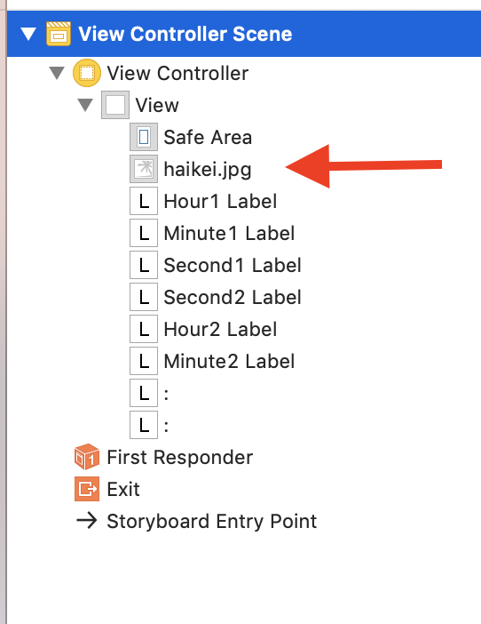

# 時計アプリ
- 画像挿入について  
 画像検索の際に、スマホの関係上縦長の画像を選ぶと画像が引き伸ばされずに選択ができるので思い通りに画像を貼れる。  
 シュミレータを動かした際に、画像が前面に出てしまい、文字（数字）が見えなくなることがある。解決策は、画像参照。  
 
- フォントの変更について
 数字の大きさを変えると、表示の関係上消える可能性がある。解決策として、表示範囲を広げることで解決できる。
